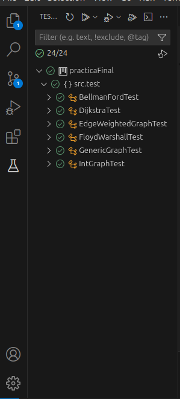

# Algoritmos de Grafos

Este repositorio contiene una implementación de grafos ponderados y algoritmos 
como Dijkstra y otros en Java. También incluye pruebas unitarias para validar el correcto 
funcionamiento de los algoritmos implementados.

## Requisitos

Antes de comenzar, asegúrate de tener instalados los siguientes elementos:

- **Java Development Kit (JDK)**: versión 8 o superior.
- **JUnit 5**: para ejecutar las pruebas unitarias.

### Instalación de Dependencias

Si no tienes JUnit 5 descargado, sigue estos pasos:

1. Descarga el archivo JAR de JUnit 5 desde su [página oficial](https://junit.org/junit5/).
   - Necesitarás los archivos `junit-platform-console-standalone-x.x.x.jar`.
2. Guarda el archivo JAR en un directorio de tu preferencia. Por ejemplo: `/path/to/junit`.

## Compilación y Ejecución de las Pruebas

En vscode descarga la extencion para Java "Extension Pack for Java" y usa la interfaz de testing
para ejecutar cada uno por separado o en conjunto

